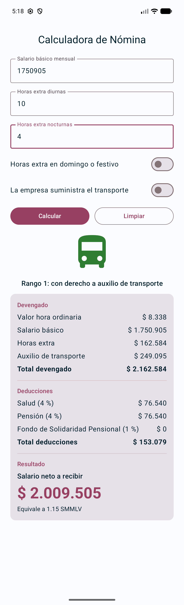
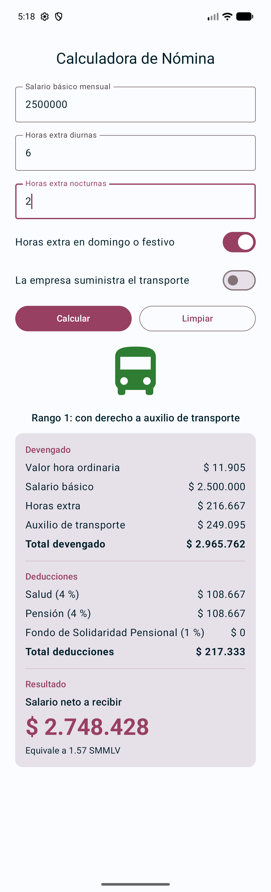
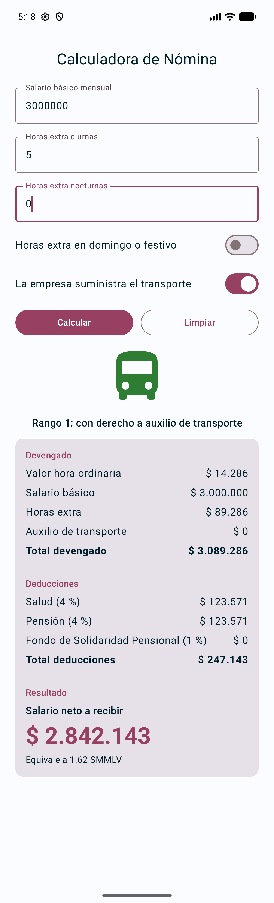
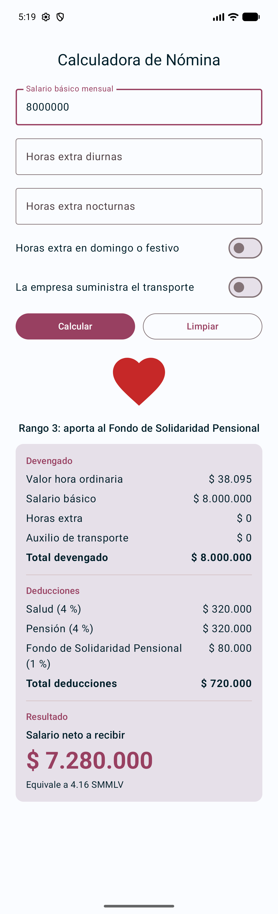

# Calculadora de Nómina Colombiana

**Estudiante:** Manuel Castellanos
**Código:** 52625

## Descripción

Aplicación Android hecha con Jetpack Compose que estima el pago mensual de un trabajador colombiano. A partir del salario básico y las horas extra del mes calcula el valor de las horas extra, decide si corresponde el auxilio de transporte, aplica las deducciones de ley y muestra el salario neto con el desglose de cada concepto.

Se usa un modelo simplificado de nómina con la normativa de septiembre de 2026 (SMMLV, auxilio de transporte, jornada de 42 horas, salud, pensión y Fondo de Solidaridad Pensional). No reemplaza una liquidación real.

## Estructura

```
app/src/main/java/com/manuelcastellanos/calculadoranomina/
    MainActivity.kt        -> pantalla principal y composables reutilizables
    NominaCalculator.kt    -> constantes, ResultadoNomina, RangoSalarial,
                              calcularNomina, clasificarRango y validarEntradas
app/src/main/res/
    drawable/              -> íconos de los tres rangos salariales
    values/strings.xml     -> todos los textos de la aplicación
```

La lógica de negocio está separada de la interfaz. `CampoNumerico` y `FilaInterruptor` son composables sin estado propio; el estado vive en `PantallaNomina`.

## Capturas de los casos de verificación

| Caso A | Caso B |
|:--:|:--:|
|  |  |

| Caso C | Caso D |
|:--:|:--:|
|  |  |

### Caso E – Validaciones

| Salario inferior al mínimo | Exceso de horas extra |
|:--:|:--:|
|  |  |

Otras capturas del caso E: [salario vacío](evidencias/caso-E1-salario-vacio.png) y [horas extra vacías](evidencias/caso-E4-horas-vacias.png).
